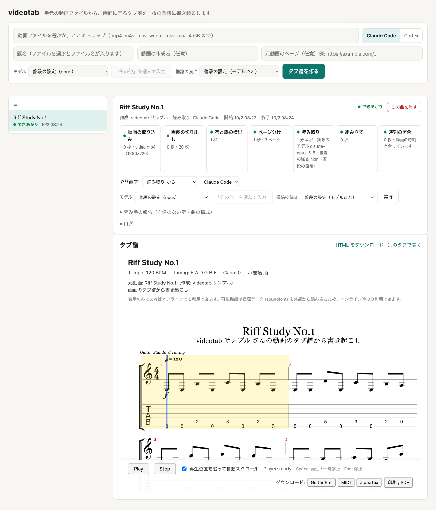

# videotab

手元の動画ファイルから、画面に写るタブ譜を 1 枚の楽譜（alphaTab の HTML＋alphaTex）に書き起こします。



画面の例は、自作の練習用リフ（8 小節）のタブ譜を写した合成の動画を、取り込みから読み取り・組み立てまで videotab で通したものです。

しくみは図つきで [videotab のしくみ](docs/index.html) にまとめてあります。

## できること

- 動画ファイル（.mp4 .m4v .mov .webm .mkv .avi、4 GB まで）を画面から送るか、コマンドで渡すと、取り込みから楽譜の表示までを自動で進めます。
- 動画をネットから取ってくる機能はありません。書き起こしたい動画は、自分で用意したものを使います。
- 画像からタブ譜を読むのは、手元でログイン済みのあなたの Claude Code か Codex です。API キーは使わず、その利用枠で動きます。
- できあがった楽譜は画面で表示・再生でき、HTML・Guitar Pro・MIDI などで持ち出せます。

## 用意するもの

- 読み取りに使う AI: [Claude Code](https://claude.com/claude-code)（`claude`）か [Codex](https://github.com/openai/codex)（`codex`）。ログインまで済ませておく
- **Mac**: Xcode Command Line Tools（`xcode-select --install`。`git` が入ります）と [Homebrew](https://brew.sh)（ffmpeg の導入に使います）
- **Linux（Ubuntu / Debian）**: `sudo apt install -y ffmpeg make git curl`

ffmpeg には、取り込む動画を確かめる ffprobe も入っています。Python は不要です（セットアップで uv が用意します）。

## セットアップと起動

このリポジトリを手元に置き、そのフォルダで次を実行します。

```sh
make setup   # uv・ffmpeg・ffprobe の確認と、依存関係の導入（何度実行しても構いません）
make web     # 画面を起動（ブラウザで http://127.0.0.1:8765/ が開きます）
```

- `make` が無い環境では `./setup.sh` → `uv run videotab serve` でも同じです。
- `make setup` は [uv](https://docs.astral.sh/uv/) と ffmpeg を確かめ、無ければ導入を提案します（同意したときだけ入れます）。そのあと `uv sync --locked` で Python 3.11 と依存関係をそろえます。uv と ffmpeg を入れてあれば、`uv sync` だけでも同じです。

## 使い方

1. 画面で動画ファイルを選ぶか、欄にドロップする。題名（ファイル名から入ります）・動画の作成者・元動画のページは必要なら直す
2. 「タブ譜を作る」を押す（読み取りに使う AI や、モデルと推論の強さも選べます）
3. 取り込みから時刻の照合までの段が順に進むのを待つ（1 曲に数分〜十数分）
4. できあがったタブ譜を画面で表示・再生し、必要ならダウンロードする

画面は手元のマシンの中だけで動きます。途中で失敗した段は、その段だけやり直せます。

画面を使わずに、コマンドで通して実行することもできます。

```sh
uv run videotab run 動画.mp4      # または: make run VIDEO=動画.mp4
```

## ドキュメント

| 文書 | 書いてあること |
|---|---|
| [画面の使い方](docs/usage.md) | 段の流れ、やり直し、読み取りの報告、曲の削除、ダウンロードの形式、画面なしの `videotab run` |
| [読み取りのモデルと推論の強さ](docs/model-settings.md) | 曲ごとの選び方、普段の設定との関係、どの値で読んだかの確かめ方 |
| [コマンド](docs/commands.md) | コマンドを 1 つずつ使う方法、コマンド一覧、作業フォルダの中身 |
| [安全のしくみ](docs/safety.md) | 読み取りの AI に許していること・止めていること、ほかのファイルを書き換えないしくみ、アップロードと動画の扱い |
| [AGENTS.md](AGENTS.md) | 画像の読み方の決まり（読み取りの AI が従う手順書）と、videotab を変更するときの決まり |

## 免責事項

- **正確さ**: 書き起こしは画像処理と AI（Claude Code / Codex）による自動のもので、誤りが含まれることがあります。正確さは保証しません。元の動画と照らして確かめてから使ってください。
- **著作権**: 動画、切り出した画像、書き起こしたタブ譜には、楽曲の権利者や、元の動画・タブ譜の作り手の著作物が含まれます。私的な練習の範囲で使い、公開・再配布・販売をしないでください。
- **AI の利用**: 読み取りは、あなたの Claude Code / Codex の利用枠を使います。選んだ（選ばなければ普段の設定の）モデルと推論の強さで動くので、強い設定ほど利用枠の減り方が大きく、時間も長くなります（1 回の起動の上限は 60 分）。利用料・上限・各サービスの規約は、利用者の責任で確かめてください。
- **無保証**: videotab は現状のまま提供します。使用によって生じたいかなる損害についても、作者は責任を負いません。
- **商標**: Claude、Codex、Guitar Pro、alphaTab などの名称は、各社・各プロジェクトの商標または登録商標です。videotab はこれらと提携・承認の関係にありません。

## 開発

```sh
make test             # または: uv run pytest
```

## ライセンス

videotab は [MIT License](LICENSE) です。

同梱しているものは、それぞれのライセンスに従います（出どころは [src/videotab/templates/vendor/VENDOR.md](src/videotab/templates/vendor/VENDOR.md)）。

- [alphaTab](https://www.alphatab.net/) 1.8.4: MPL-2.0
- Bravura フォント: SIL Open Font License 1.1（[Bravura-OFL.txt](src/videotab/templates/vendor/Bravura-OFL.txt)）
