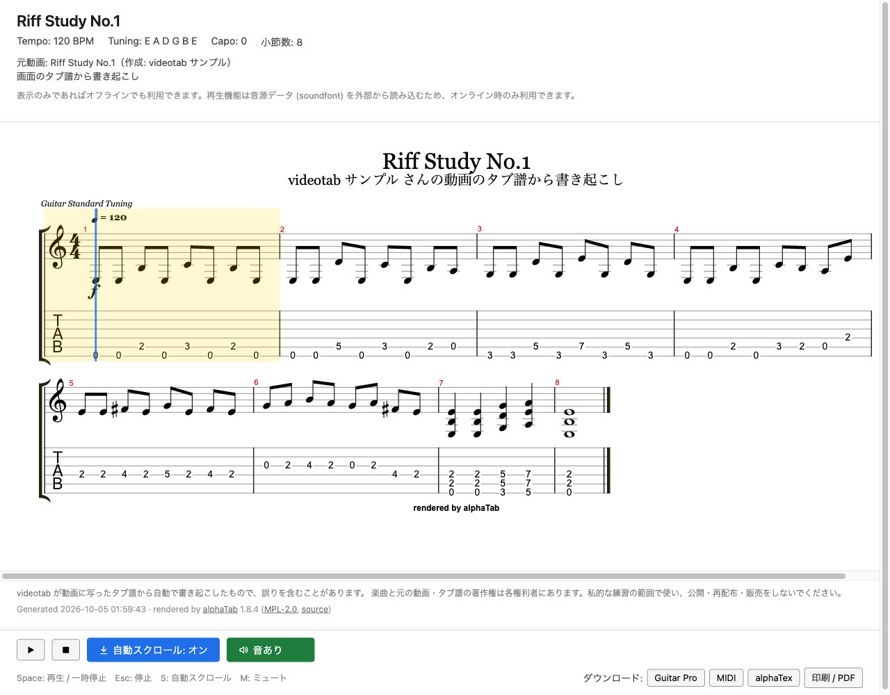

# videotab

手元の動画ファイルや、紙の楽譜の写真・PDF から、タブ譜を書き起こします。できあがるのは、ブラウザで開いて表示・再生できる 1 枚の楽譜です。

<table>
  <tr>
    <th>画面</th>
    <th>できあがった楽譜（HTML）</th>
  </tr>
  <tr>
    <td width="50%" valign="top"></td>
    <td width="50%" valign="top"></td>
  </tr>
</table>

画面の例は、自作の練習用リフ（8 小節）のタブ譜を写した合成の動画を、取り込みから読み取り・組み立て・時刻の照合まで videotab で通したものです。右は、できあがった楽譜を単独の HTML として開いたところです。

しくみは図つきで [videotab のしくみ](https://shimabox.github.io/videotab/) にまとめてあります。

## できること

- 動画ファイル（.mp4 .m4v .mov .webm .mkv .avi、4 GB まで）を画面から送るか、コマンドで渡すと、取り込みから楽譜の表示までを自動で進めます。
- バンドスコアなど紙の楽譜を撮った動画・写真・PDF からも書き起こせます。楽譜にあるパートを AI が洗い出すので、書き起こすパートを一覧から選びます（6 弦ギター・4 弦ベース。[紙の楽譜から書き起こす](docs/paper.md)）。
- 動画をネットから取ってくる機能はありません。書き起こしたい動画は、自分で用意したものを使います。
- 画像からタブ譜を読むのは、あなたがログイン済みの Claude Code か Codex（ターミナルで動く AI）です。API キー（AI を使うための別契約の鍵）は使わず、いつもの利用枠で動きます。
- できあがった楽譜は画面で表示・再生でき、HTML・Guitar Pro・MIDI などで持ち出せます。

## 用意するもの

- **読み取りに使う AI**: [Claude Code](https://claude.com/claude-code)（`claude`）か [Codex](https://github.com/openai/codex)（`codex`）。ログインまで済ませておきます。
- **Xcode Command Line Tools**: Mac で開発用の基本の道具（`git` や `make`）を入れるものです。ターミナルで `xcode-select --install` を実行します。
- **[Homebrew](https://brew.sh)**: Mac にソフトを入れる道具です。ffmpeg（動画を画像に切り出すソフト）を入れるのに使います。

ffmpeg と uv（Python と必要な部品をそろえる道具）は、セットアップのときに無ければ、入れるかどうかを聞かれます。Python を自分で入れる必要はありません。

Linux（Ubuntu / Debian）では、`sudo apt install -y ffmpeg make git curl` で用意します。

## セットアップと起動

ターミナルで次を順に実行します。

```sh
git clone https://github.com/shimabox/videotab.git   # videotab を手元にダウンロード
cd videotab                                          # ダウンロードしたフォルダに移る
make setup   # 必要なものの確認と導入（何度実行しても構いません）
make web     # 画面を起動（ブラウザで http://127.0.0.1:8765/ が開きます）
```

- 画面を止めるときは、起動したターミナルで Ctrl+C を押します。次からは `cd videotab` のあと `make web` だけで起動できます。
- `make` で command not found と出たら、`./setup.sh` → `uv run videotab serve` でも同じです。
- `make setup` で行うことの詳細は [コマンド](docs/commands.md#セットアップで行うこと) にあります。

## 使い方

1. 画面で動画ファイル（紙の楽譜なら写真・PDF・ZIP も）を選ぶか、欄にドロップする。題名はファイル名から付く（あとから曲の詳細の「曲の情報」で直せます）
2. 「タブ譜を作る」を押す。読み取りに使う AI や、モデルと推論の強さ（AI がどれだけ時間をかけて考えるか。強いほど丁寧になりやすいが、遅く、利用枠も多く使う）も選べます
3. 取り込みから時刻の照合までの段が順に進むのを待つ（1 曲に数分〜十数分）。紙の楽譜は途中で「パートの選択待ち」になるので、書き起こすパートを一覧から選ぶ
4. できあがったタブ譜を画面で表示・再生し、必要ならダウンロードする

画面はあなたのマシンの中だけで動き、ネットには公開されません。途中で失敗した段は、その段だけやり直せます。

画面を使わずに、コマンドで通して実行することもできます。

```sh
uv run videotab run 動画.mp4      # または: make run VIDEO=動画.mp4
```

## ドキュメント

| 文書 | 書いてあること |
|---|---|
| [画面の使い方](docs/usage.md) | 段の流れ、やり直し、AI の報告、曲の削除、ダウンロードの形式、画面なしの `videotab run` |
| [紙の楽譜](docs/paper.md) | 写真・PDF・紙を撮った動画の取り込み、パートの選び方、動画の種類の見分け方、うまくいかないとき |
| [読み取りのモデルと推論の強さ](docs/model-settings.md) | 曲ごとの選び方、普段の設定との関係、どの値で読んだかの確かめ方 |
| [コマンド](docs/commands.md) | コマンドを 1 つずつ使う方法、コマンド一覧、作業フォルダの中身 |
| [安全のしくみ](docs/safety.md) | 読み取りの AI に許していること・止めていること、ほかのファイルを書き換えないしくみ、アップロードと動画の扱い |
| [AGENTS.md](AGENTS.md) | 画像の読み方の決まり（読み取りの AI が従う手順書）と、videotab を変更するときの決まり |

## 既知の問題

- **五線のスライド・ハンマリングの弧が消えることがある**: 2 音の和音にスライド（`{sl}`）やハンマリング（`{h}`）が付き、そのあとに音符が詰まって続く所では、楽譜の幅が狭いと五線の弧（スラー）が描かれないことがあります（タブ譜の弧は描かれます）。楽譜を描く部品 alphaTab（1.8.4）の不具合で、[alphaTab に報告済み](https://github.com/CoderLine/alphaTab/issues/2904)です。直った版が出たら差し替えます。それまでは、広い画面で開くと起きにくくなります（ブラウザの開発者ツールには `<path> attribute d: Expected number` のエラーが出ます）。

## 免責事項

- **正確さ**: 書き起こしは画像処理と AI（Claude Code / Codex）による自動のもので、誤りが含まれることがあります。正確さは保証しません。元の動画と照らして確かめてから使ってください。
- **著作権**: 動画、切り出した画像、書き起こしたタブ譜には、楽曲の権利者や、元の動画・タブ譜の作り手の著作物が含まれます。私的な練習の範囲で使い、公開・再配布・販売をしないでください。
- **AI の利用**: 読み取りは、あなたの Claude Code / Codex の利用枠を使います。選んだ（選ばなければ普段の設定の）モデルと推論の強さで動くので、強い設定ほど利用枠の減り方が大きく、時間も長くなります（1 回の起動の上限は 60 分）。利用料・上限・各サービスの規約は、利用者の責任で確かめてください。
- **無保証**: videotab は現状のまま提供します。使用によって生じたいかなる損害についても、作者は責任を負いません。

## 開発

videotab 自体を改造する人向けです。決まりは [AGENTS.md](AGENTS.md) の「開発の決まり」にあります。

```sh
make test             # テストを実行（または: uv run pytest）
```

## ライセンス

videotab は [MIT License](LICENSE) です。

同梱しているものは、それぞれのライセンスに従います（出どころは [src/videotab/templates/vendor/VENDOR.md](src/videotab/templates/vendor/VENDOR.md)）。

- [alphaTab](https://www.alphatab.net/) 1.8.4: MPL-2.0
- Bravura フォント: SIL Open Font License 1.1（[Bravura-OFL.txt](src/videotab/templates/vendor/Bravura-OFL.txt)）
